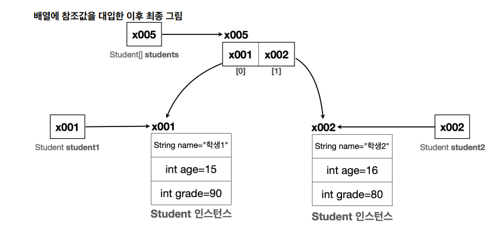

# 클래스와 데이터

## 클래스가 필요한 이유

## 1. 변수로 객체 만들기
- 만약 학생 정보 출력 프로그램을 만들어야 한다.
- 포맷은 다음과 같다. `이름 : OOO 나이 : O세 전공 : 문과 또는 이과`
- 현재 2명의 인원이 있고 다음과 같이 출력을 한다.

**변수를 이용한 출력**

```java
public void Students() {
    String student1Name = "학생1";
    int student1Age = 15;
    String student1Major = "문과";
    
    String student2Name = "학생2";
    int student2Age = 16;
    String student2Major = "이과;
}
```
이렇게 했을 때 수정을 하기에도 코드를 보기에도 너무 복잡해서 `배열`을 한번 사용해보도록 하자

<br>


## 2. 배열로 객체 만들기
**배열을 이용한 출력**
```java
public void Students() {
    String[] studentNames = {"학생1", "학생2"};
    int[] studentAges = {15, 16};
    String[] studentMajor = {"문과", "이과"}
}
```
배열을 사용한 덕분에 학생이 추가되어도 변수를 만들지 않고 배열에 학생의 데이터만 추가하면 된다.   
하지만 만약에 학생이 1,000명이 있을 때 해당 인덱스에 맞게 관리해야 한다면 상상만 해도 끔찍하다.

사람이 관리하기 좋은 방식은 학생이라는 개념을 하나로 묶는 것이다. 그리고 각각의 학생 별로 본인의 이름, 나이, 전공을 관리하는 것이다.


## 3. 클래스 도입하기
`class` 키워드를 사용해서 학생 클래스(`Student`)를 정의해보겠습니다.
```java
public class Student {
    String name;
    int age;
    String major;
}
```
이제 한번 클래스로 학생을 만들어보자
```java
Student student1;
student1.name = "학생1";
student1.age = 15;
student1.major = "문과";
```

**student1 = new Student() 코드를 나누어 분석해보자.**
- `new Student()` : new는 새로 생성한다는 뜻으로 `new Student()`는 `Student` 클래스 정보를 기반으로 새로운 객체를 생성하라는 뜻이다. 이렇게 하면 메모리에 실제 Student 객체(인스턴스)를 생성한다.
- `Student` 클래스는 String name, int age, String major 멤버 변수를 가지고 있다. 이 변수를 사용하는데 필요한 메모리 공간도 함께 확보한다.


<br>

**클래스와 사용자 정의 타입**   
- 클래스는 관례상 대문자로 시작하고 낙타 표기법을 사용한다.
- 클래스를 사용하면 `int`, `String`과 같은 타입을 직접 만들 수 있다.
- 사용자가 직접 정의하는 사용자 정의 타입을 만들기 위해서 지금 배우는 `클래스`를 알아야한다.
- 설계도인 클래스를 사용해서 **실제 메모리에 만들어진 실체를 객체 또는 인스턴스**라고 한다.
- 클래스를 통해서 사용자가 원하는 종류의 데이터 타입을 마음껏 정의할 수 있다.

<br>

### 클래스, 객체, 인스턴스 정리
**클래스 - Class**    
클래스는 객체를 생성하기 위한 '틀' 또는 '설계도'이다. 객체가 가져야 할 속성(변수)과 기능(메서드)를 정의한다.
- 틀 : 붕어빵 틀을 생각해보자. 이렇게 생긴 붕어빵이 나왔으면 좋겠다고 만드는 틀일 뿐이고 실제로 먹을 수없다.
- 설계도 : 자동차 설계도를 생각해보자. 실제 자동차가 아니지만 설계도를 통해 실제 존재하는 자동차를 만들 수 있다.

**객체 - Object**   
객체는 클래스에서 정의한 속성과 기능을 가진 `실체`이다. 객체는 서로 독립적인 상태를 가진다.   
위에서 한 것처럼 `student1`과 `student2`는 같은 클래스(틀)에서 만들어졌지만, 서로 다른 객체이다.

**인스턴스 - Instance**   
인스턴스는 특정 클래스로부터 생성된 객체를 의미한다. 그래서 객체와 인스턴스라는 용어는 자주 혼용된다. 인스턴스는 주로 `객체가 어떤 클래스에 속해 있는지를 강조`할 때 사용한다. 예를 들어서 `student1`객체는 `Student` 클래스의 인스턴스다. 라고 표현한다.

보통 `student1 은 Student 의 객체`이다. 라고 말하는 대신 `student1 은 Student 의 인스턴스`이다. 라고 특정 클래스와의 관계를 명확히 할 때 인스턴스라는 용어를 주로 사용한다.

하지만 둘다 클래스에서 나온 실체라는 핵심 의미는 같기 때문에 `보통 둘을 구분하지 않고 사용`한다.


## 4.클래스에 배열 도입
배열을 사용하면 특정 타입을 연속한 데이터 구조로 묶어서 편리하게 관리할 수 있다.
```Java
Student[] students = new Student[2];
students[0] = student1;
students[1] = student2;
```
이렇게 작성하면 student 인스턴스를 2개 가질 수 있다.



### 이 파트에서 강조한 것
변수에는 인스턴스 자체가 들어있는 것이 아니다! 인스턴스의 위치를 가리키는 참조값(메모리 위치)이 들어있을 뿐이다! 따라서 대입
( = )시에 인스턴스가 복사되는 것이 아니라 참조값만 복사된다.


## 배열 리팩토링
```java
Student student1 = new Student();
student1.name = "학생1";
student1.age = 15;
student1.grade = 90;
Student student2 = new Student();
student2.name = "학생2";
student2.age = 16;
student2.grade = 80;


// 이렇게 선언한 것을
Student[] students = new Student[2];

// 다음과 같이 촤적화할 수 있고
Student[] students = new Student[]{student1, student2};

// 생성과 선언을 동시에 하는 경우 다음과 같이 더 최적화 할 수 있다.
Student[] students = {student1, student2};


// 또한 for문으로 이렇게 할 수 있는데
Student[] students = {student1, student2};
for(int i = 0; i < students.length; i++) {
    System.out.println("이름 : " + students[i].name + "나이 : " + students[i].age)
}

// 반복 요소를 변수에 담아서 처리할 수 있고
Student[] students = {student1, student2};
for (int i = 0; i < students.length; i++) {
    Student s = students[i];
    System.out.println("이름:" + s.name + " 나이:" + s.age + ...);
}

// 이 또한 '1.기초'에서 배운 향상된 for문으로 최적화 할 수 있다.
Student[] students = {student1, student2};
for(Student st : students) {
    System.out.println("이름 : " + st.name + "나이 : " + st.age)
}
```
[향상된 for문 확인하기](./1.기초.md#배열을-위한-향성된-for문-for-each문)


