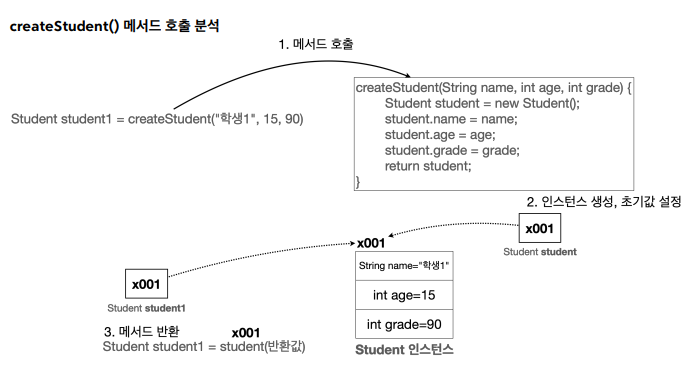

# 기본형과 참조형

## 핵심 이것만 기억하자
### 기본형의 대원칙
- **기본형(Primitive Type)** : int, long, double, boolean처럼 변수에 사용할 값을 직접 넣을 수 있는 데이터 타입
- **원칙** : 값이 직접 복사됩니다. 변경해도 다른 변수에 영향을 주지 않습니다.
- **비유** : 기본형은 종이에 적은 숫자를 복사해서 다른 종이에 옮기는 것과 같습니다. 원본을 지우거나 바꿔도, 복사한 종이는 그대로 남아 있습니다.
### 참조형의 대원칙
- **참조형 (Reference Type)** : `Student student1`, `int[] students`와 같이 데이터에 접근하기 위한 참조(주소)를 저장하는 데이터 타입
- **원칙** : 메모리 주소가 복사됩니다. 하나를 변경하면 다른 변수도 영향을 받습니다.
- **비유** : 친구와 같은 집을 공유하는 것과 같습니다. 집 안의 가구를 바꾸면, 그 집에 사는 모든 사람이 그 변화를 보게 됩니다.

---
## 1. 참조형과 메서드 호출 - 활용
이전에 보았던 class1.ClassStart3 코드에는 중복되는 부분이 2가지 있다.
- name , age , grade 에 값을 할당 
- 학생 정보를 출력

**기존 코드**
```java
package class1;

public class ClassStart3 {
    public static void main(String[] args) {
        Student student1;
        student1 = new Student();
        student1.name = "학생1";
        student1.age = 15;
        student1.grade = 90;
        
        Student student2 = new Student();
        student2.name = "학생2";
        student2.age = 16;
        student2.grade = 80;
        
        System.out.println("이름:" + student1.name + " 나이:" + student1.age + " 성
        적:" + student1.grade);
        System.out.println("이름:" + student2.name + " 나이:" + student2.age + " 성
        적:" + student2.grade);
    }
}
```
- 개선하고 싶은 부분 : 새로운 클래스에 값을 할당하는 것과 출력하는 부분이 반복된다.

<br/>

### 메서드로 객체 전달하기
새로운 패키지로 `Student` 클래스를 만든다.
```java
public class Student {
    String name;
    int age;
    String major;
}
```
그 다음에 중복이 되는 생성자 코드와 출력 코드를 함수로 만든다.
```java
Student student1 = new Student();

static void initStudent(Student student, String name, int age, String major) {
    student.name = name;
    student.age = age;
    student.major = major;
}

static void printStudent(Student student) {
    System.out.println("학생 메모리는 : " + student + "   학생 이름 : " + student.name + "   나이 : " + student.age + "   전공 : " + student.major);
}
```
여기서 새로운 객체를 생성하기 위해 이 코드를 넣으면 된다.
```java
Student student1 = new Student();
initStudent(student1, "학생1", 19, "문과");
printStudent(student1);   
```   

<br/>

우리가 말했던 [대원칙](#핵심-이것만-기억하자)에서 생성자는 참조값을 넘겨주는 걸 다시 한번 기억하면 좋을 것 같습니다. 

<br/>

### createStudent() 메서드를 생성하여 객체를 더욱 간략하게 만들어보기
이번에는 우리가 매번 객체를 생성할 때 사용하는 코드를 더 간략하게 리팩토링을 해보겠습니다.
```java
public static void main(String[] args) {
    Student student1 = createStudent("학생1", 15, "문과");
    printStudent(student1);
}

static Student createStudent(String name, int age, String major) {
    Student student = new Student();
    student.name = name;
    student.age = age;
    student.major = major;

    return student;
}

static void printStudent(Student student) {
    System.out.println("학생 메모리는 : " + student + "   학생 이름 : " + student.name + "   나이 : " + student.age + "   전공 : " + student.major);
}
```


1. createStudent() 메서드를 호출하면 메서드 안에서 인스턴스가 생성되고 초기값 설정이 된다. 
2. 인스턴스가 만들어지면서 생긴 메모리 주소를 `return student;`로 반환을 시킨다.
3. 반환된 student는 변수 `Student student1`에 그 값이 아니라 값이 참조되어 있는 메모리 주소를 전달 받는다.


### dddd


